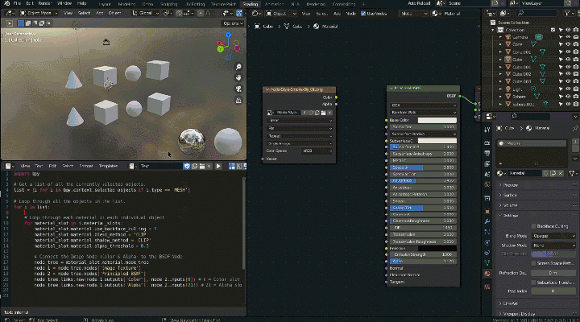
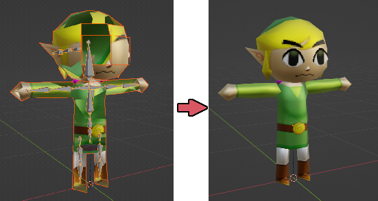

# Useful Blender Scripts
 A collection of useful python scripts for certain tasks in Blender.

Currently only `3` scripts in this repository so far.

## set_alph.py script
Automatically plugs the `Color` and `Alpha` nodes together, as well as sets a few other parameters to display Alpha transparency on selected objects. Useful for imported models found on [The Models Resource](https://www.models-resource.com/).

## fix_ph_link.py script
Used to fix the [Phantom Hourglass Link FBX model](https://www.models-resource.com/ds_dsi/legendofzeldaphantomhourglass/sheet/7794/) from Models Resource. This script sets the proper blend mode (CLIP) as well as "Closest" interpolation on textures to mimmic the DS's look.

